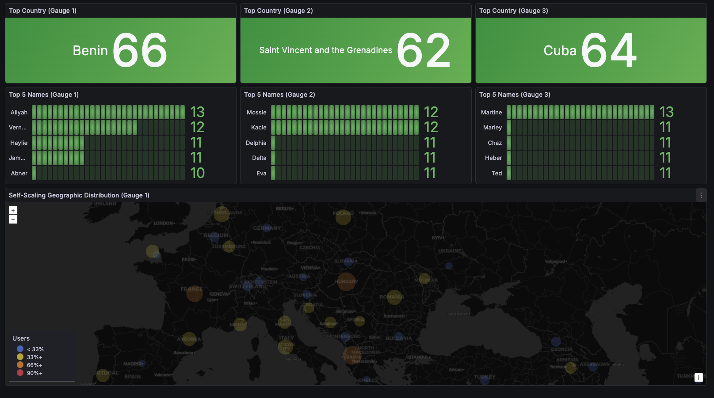
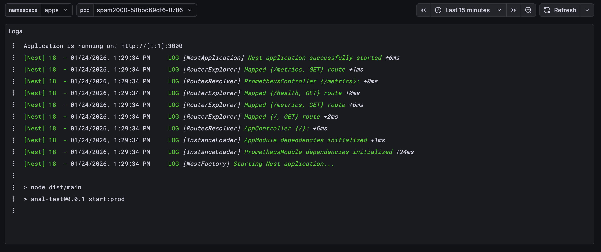

# Тестове завдання DevOps Engineer

## Технічний стек

|Компонент | Технологія | Призначення
| --- | --- | --- |
|Orchestration | Minikube | Локальний Kubernetes кластер
|Monitoring | VictoriaMetrics | Збір та зберігання метрик
|Visualization | Grafana | Дашборди та візуалізація
|Package Manager | Helm | Управління Kubernetes застосунками
|Application | spam2000 | Додаток який спамить метриками
|GitOps Tool | FluxCD | Автоматизація розгортання застосунків з Git репозиторію

## Вимоги до середовища
 - [minikube](https://minikube.sigs.k8s.io/docs/start/)
 - [kubectl](https://kubernetes.io/docs/tasks/tools/)
 - [helm](https://helm.sh/docs/intro/install/) (v3+)

## Інструкція по запуску
1. Клонувати репозиторій:
   ```bash
   git clone https://github.com/alexvarko/gitops-test-task.git
   ```
2. Перейти в директорію проєкту:
   ```bash
   cd gitops-test-task
   ```
3. Запустити скрипт:
    ```bash
    chmod +x ./setup.sh
    ./setup.sh
    ```

## Конфігурація GitOps
 - Необхідно змінити налаштування GitRepository у `charts/flux-spam2000/values.yaml`, щоб вказати URL вашого репозиторію. Наприклад:
   ```yaml
   gitRepository:
     enabled: true
     name: gitops-test-task
     url: https://github.com/your-account/gitops-test-task.git
    ```

## Опис
 - Скрипт створює локальний Kubernetes кластер за допомогою Minikube.
 - Розгортає FluxCD із ресурсами для GitOps.
 - FluxCd автоматично розгортає застосунок spam2000 та моніторинг із Helm-чартів, розміщених в тому ж репозиторії. Далі FluxCD слідкує за змінами в репозиторії і автоматично застосовує їх у кластері.
 - Застосунок spam2000 генерує метрики, які збираються VictoriaMetrics.
 - У Grafana налаштовано дашборд для візуалізації метрик від spam2000, а також дашборди для моніторингу ресурсів кластера.


## Дашборди Grafana

### Spam200 Dashboard


### Logs Dashboard

